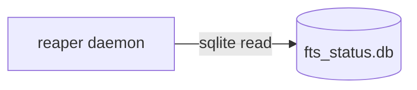

# Mega-review per-package contract

Every package agent in the September 2026 DAQ mega-review follows this document exactly.
It exists so that 45 independently-run agents produce one coherent corpus instead of 45 dialects.

Branch in every repo: **`mu2e-sept-mega-review`** (already created in Wave 0 — do not create it).

---

## 0. Hard rules

1. **Do not fix code.** You file issues. The only files you may change are documentation,
   man pages, `README.md`, and man-layout `git mv`s. No behavioural change to any `.py`, `.cc`,
   `.sh`, or config file. Two exceptions, both pure prose: replacing a boilerplate `README.md`,
   and correcting `mu2edaq-config/README.md`'s fictional directory tree.
2. **Stay in your own package directory.** Never write to `../mu2edaq-documentation`, never
   `git add` in the superproject, never run `git submodule foreach`.
3. **Never push to `main`** in `mu2edaq-documentation` — that publishes live to
   `mu2e-exp.fnal.gov/online/`.
4. **Do not guess a fact you cannot verify.** If two sources disagree about a hostname, port,
   or node range, file an issue and say so. Do not pick one silently.
5. **Rate limits.** Sleep 4 seconds between `gh issue create` calls. File at most 15 issues;
   if you have more, file the top 15 by severity and one rollup issue listing the rest.

---

## 1. Tiers

| Tier | Packages | Treatment |
|---|---|---|
| **A** | all `mu2edaq-*`, `mu2ebintools`, `Bootstrap` | Full: read all source. |
| **B** | `otsdaq-mu2e*`, `artdaq-core-mu2e`, `artdaq-mu2e`, `mu2e-pcie-utils` | Structural + interface only. |
| **C** | `mu2edaq-kpp-scripts`, `mu2e-tdaq-suite` | Stub note + one issue. |

**Tier B read allowlist — this is a prohibition, not a suggestion.** Read only:
`CMakeLists.txt`, public headers (`*/inc/**`, overlay and interface headers), plugin registration
macros (`DEFINE_ARTDAQ_*`, `DEFINE_OTS_*`), `*.fcl`, `tools/`, `scripts/`, `doc/` index, `README.md`.
**Do not read `.cc`/`.cpp` bodies** except to resolve one named symbol you have already found in a
header. `otsdaq-mu2e` is 33 kLOC and `mu2e-pcie-utils` is 37 kLOC; reading them will exhaust your
context and produce a truncated, confidently-wrong manifest. Tier B's deliverable is
`INTERFACES.md` — what the package exposes and what loads it — not an implementation review.

---

## 2. Output artifacts

`$DOC` = **`doc/` if that directory already exists, else `docs/`**.
**Do not rename between the two.** In the otsdaq/artdaq family `doc/` is wired into `Doxyfile.in`
and `CMakeLists.txt`; renaming breaks the Doxygen build for no reader benefit. Record which one you
used in the manifest.

| Artifact | Path | A | B | C |
|---|---|---|---|---|
| Manifest | `$PKG/$DOC/package.yaml` | required | required | required |
| Architecture | `$PKG/$DOC/ARCHITECTURE.md` | required | short (≤1 page) | — |
| Interfaces | `$PKG/$DOC/INTERFACES.md` | required | **primary deliverable** | — |
| Operations | `$PKG/$DOC/OPERATIONS.md` | if it ships a daemon/service | — | — |
| Install | `$PKG/$DOC/INSTALL.md` | if absent and the package builds | — | — |
| README | `$PKG/README.md` | create if missing; replace if boilerplate | replace boilerplate | — |
| Man pages | `$PKG/man/manN/` | required (§4) | shipped executables only | — |
| Staged issues | `$PKG/$DOC/ISSUES-PENDING.md` | only if no usable remote | same | same |

READMEs to **create** (currently absent): `mu2edaq-CFOControl`, `mu2edaq-operations`,
`mu2edaq-runlog-db`, `mu2ebintools`.
READMEs to **replace** (identical 23-line boilerplate): the 12 `otsdaq-mu2e*`/`artdaq-*`/
`mu2e-pcie-utils` ones, plus the 2-line `otsdaq-mu2e-config`.

---

## 3. `package.yaml` — the manifest

This is the **only** file the Wave 3 aggregator reads. If it is wrong, the published
architecture diagrams are wrong. Emit it last, after you have read the package.

```yaml
schema: mega-review/1
package: mu2edaq-file-reaper
tier: A                        # A | B | C
group: data-movement           # from the fixed vocabulary below — do not invent one
repo:
  url: git@github.com:Mu2e/mu2edaq-file-reaper.git   # "" if none
  exists: false                # does it resolve on GitHub?
  issues_enabled: false
doc_dir: docs                  # "doc" or "docs" — exactly what you used
summary: >
  One sentence, no trailing period issues. Becomes the index row and the card blurb.
languages: [python, cpp]
loc: 10247

runtime:
  executables:                 # every entry needs man_page, or waiver: with a reason
    - name: mu2edaq-file-reaper
      kind: daemon             # daemon | cli | gui | library | plugin | script
      man_page: man/man1/mu2edaq-file-reaper.1
  services: [mu2edaq-file-reaper.service]
  ports:                       # Wave 2 builds the authoritative port table from these
    - {port: 5004, proto: tcp, role: web-ui, source: "config/mu2edaq-file-reaper.yaml:18"}
  config_files: [config/mu2edaq-file-reaper.yaml]
  env_vars: [MU2EDAQ_FILE_REAPER_CONFIG]

interactions:
  depends_on:
    - package: mu2edaq-fts
      via: sqlite-read         # http | zmq | udp | sqlite-read | subprocess | import | link | ssh
      direction: out
      evidence: "src/mu2edaq_file_reaper/fts_gate.py:44"    # MANDATORY file:line
  depended_on_by: []           # LEAVE EMPTY — computed by the aggregator
  external: [smtp, slack]

quality:
  tests: {present: true, framework: pytest, count: 182}
  ci: {present: false, workflows: []}
  license: MIT
  artifacts_clean: true        # `git ls-files` shows no venv/build/db/key

findings:
  - id: FR-001
    severity: S2
    type: bug                  # bug | documentation | enhancement
    title: "[config] ..."
    issue: "https://github.com/Mu2e/.../issues/7"    # or "pending" if staged
    fingerprint: a1b2c3d4
```

**`group` vocabulary — exactly these nine strings:**
`artdaq-data-path`, `otsdaq-plugins`, `substrate`, `monitoring`, `data-movement`,
`control-room`, `network-arbitration`, `identity`, `operations`.

**Two rules that matter most:**

- `depends_on[].evidence` is a mandatory `file:line` that must exist. Without it the dependency
  graph becomes fiction, and Wave 4 rejects the manifest.
- `depended_on_by` stays empty. The aggregator computes it by inverting all 45 manifests.
  If 16 agents each guess at `mu2edaq-discovery`'s dependents, 16 answers disagree.

---

## 4. Man pages

**Layout: `man/manN/` subdirectories, always.** The exemplars
(`mu2edaq-power-recovery`, `mu2edaq-file-reaper`, `mu2edaq-shifter-tools`) all do this.
Ten packages use a flat `man/*.1` — `git mv` them into `man/man1/`.
`mu2edaq-trigger-scalers` has three roff files under `docs/man/` — `git mv` to `man/man1/`.

| Section | Contents | Naming |
|---|---|---|
| `man1` | user-invokable executables and scripts | exact command name, including `.sh` if that is how it is invoked |
| `man3` | importable libraries (Python modules, C/C++ libs) | `mu2edaq_file_reaper.3`, `libmu2eprobe.3` |
| `man5` | config file formats | the filename: `mu2edaq-topology.yaml.5` |
| `man7` | protocols, APIs, package overview | `<pkg>-api.7`, `<pkg>.7` |

Fixed header line:

```roff
.TH MU2EDAQ-FILE-REAPER 1 "2026-09-30" "mu2edaq-file-reaper 0.1.0" "Mu2e DAQ Manual"
```

Uppercase name, section number, ISO date, `<package> <version>`, literal `Mu2e DAQ Manual`.

Required sections, in this order (omit only what genuinely does not apply):
`NAME` (with the `\-` separator), `SYNOPSIS`, `DESCRIPTION`, `OPTIONS`, `FILES`, `ENVIRONMENT`,
`EXIT STATUS`, `EXAMPLES`, `SEE ALSO`, `AUTHOR`.

Cross-references use `.BR name (1)`. Every page must pass both:

```bash
mandoc -T lint man/man1/foo.1        # no ERROR or UNSUPP
groff -mandoc -Tutf8 -ww -z man/man1/foo.1   # no stderr
```

Document the **actual** options. Read the argument parser; do not infer flags from the README.

---

## 5. Documentation page format

`ARCHITECTURE.md` front matter reuses the `mu2edaq-documentation` vocabulary
(`audience:` ∈ `shifter, runco, expert`) — do not invent a second scheme.

```markdown
---
title: mu2edaq-file-reaper
group: data-movement
tier: A
audience: expert
summary: <identical to package.yaml summary>
---

# mu2edaq-file-reaper

> <summary>

| | |
|---|---|
| Repository | `Mu2e/mu2edaq-file-reaper` |
| Language | Python 3.9 |
| Ports | 5004/tcp (web UI) |
| Depends on | `mu2edaq-discovery`, `mu2edaq-fts` |

## Purpose
## Architecture



## Components
## Interfaces
## Configuration
## Operations
## Interactions with other packages
## Review findings
```

Mermaid: use fenced ```mermaid blocks. Both output sites render them natively — do not add
any `<script>` tag or HTML wrapper.

Write for a DAQ expert who has not seen this package. State mechanisms and cite `file:line`.
Do not pad with generic advice.

---

## 6. Issues

### Severity rubric — calibrate against these real anchors

| | Meaning | Anchor from this codebase |
|---|---|---|
| **S1** | Data loss, security exposure, or wrong physics. Fix now. | a credential committed to git history; a delete path with no dry-run guard |
| **S2** | Production breakage or silent wrong behaviour; workaround exists. | `connecting.md` binds `-L 3025` twice, silently dropping the HWDev tunnel; `verify_tls: false` shipped as the default |
| **S3** | Correctness or maintainability risk, no current outage. | the app inventory triplicated with no generator; a package with 180 tests and no CI |
| **S4** | Cosmetic, stale, hygiene. | a commented-out `diskwatcher: 8093` example; trailing whitespace; missing LICENSE |

If you are torn between two levels, pick the lower one and say why in the body.

### Title

`[<area>] <noun phrase or imperative>` — e.g.
`[config] reverse-proxy example block contradicts the 5002 diskwatcher convention`.
No severity in the title; severity is revisable, titles are not.

### Body — use this template verbatim

```markdown
**Severity:** S2 — production breakage or silent wrong behaviour; workaround exists
**Category:** bug
**Location:** `config/reverse-proxy.yaml:43`
**Found by:** mega-review (`mu2e-sept-mega-review`), 2026-09-30

## What
One or two sentences.

## Evidence
```
$ grep -n 'diskwatcher' config/reverse-proxy.yaml
43:  #   diskwatcher: 8093
```

## Why it matters
The concrete operational consequence. If there is none, this is S4.

## Suggested fix
Specific and minimal.

## Related
- Mu2e/mu2edaq-discovery#12

<!-- mega-review-fingerprint: a1b2c3d4 -->
```

`fingerprint = sha1("<repo>:<path>:<rule_id>")[:8]`, where `rule_id` is a short stable slug for the
kind of defect (`port-conflict`, `missing-man-page`, `no-ci`). **It must not include a line number** —
that is what lets a re-run comment instead of duplicating.

### Labels

Create one label per repo, idempotently, then apply it plus exactly one default category label:

```bash
gh label create mega-review -R "$REPO" -c 6F42C1 \
  -d "Filed by the Sept 2026 DAQ mega-review" 2>/dev/null || true
gh issue create -R "$REPO" --label mega-review --label bug ...
```

Do **not** create severity labels — severity is in the body, and four labels across forty repos is
160 label creations carrying no new information.

### Dedup — once per repo, before you file anything

```bash
gh issue list -R "$REPO" --state all --limit 300 --json number,title,body,state > /tmp/existing.json
```

1. Exact fingerprint already present in any body → `gh issue comment` with the new evidence.
   **Never** open a second issue for the same fingerprint.
2. No fingerprint match, but ≥2 significant title tokens overlap an open issue → default to
   commenting, and note the judgement in your manifest.
3. Otherwise file.

This matters most in `Mu2e/daq-operations` (36 open), `mu2edaq-power-recovery` (25),
`otsdaq-mu2e` (12). Naive filing there produces obvious duplicates and burns credibility.

### Routing where the remote is unusable

| Package | Route |
|---|---|
| `artdaq-core-mu2e` | File to **`Mu2e/artdaq-core-mu2e`**. The submodule URL points at `normanajn/artdaq-core-mu2e`, which has issues **disabled**; the URL itself is a separate S3 filed against `Mu2e/mu2edaq-main`. |
| `mu2edaq-file-reaper` | No remote, and `Mu2e/mu2edaq-file-reaper` 404s. **Do not create the repo.** Write every finding to `docs/ISSUES-PENDING.md` in the exact body format above, fingerprints included. |
| `mu2edaq-kerberos-standards` | This is a **git worktree of `mu2edaq-kerberos`**, not a separate package. Document it once, as `mu2edaq-kerberos`. Do not produce a second manifest. |
| `mu2edaq-operations` | Its remote is **`Mu2e/daq-operations`**, not `mu2edaq-operations`. File there. |
| `mu2edaq-kpp-scripts`, `mu2e-tdaq-suite` | One issue each: empty stub, declare intent or remove from `.gitmodules`. |

---

## 7. Commits

```
docs(mu2edaq-file-reaper): add architecture, interface and operations docs

Refs: mega-review
Co-Authored-By: Claude Opus 5 <noreply@anthropic.com>
```

`type` ∈ `docs | fix | chore`. At most 3 commits per package:
docs, man pages, man-layout normalization. **Commit on the branch; do not push** — Wave 4
pushes submodules first and the superproject gitlink last.

---

## 8. Before you finish

- [ ] `package.yaml` parses, `group` is from the vocabulary, every `evidence` is a real `file:line`
- [ ] every `runtime.executables[]` entry has a `man_page` that exists, or a stated waiver
- [ ] every man page passes `mandoc -T lint` and `groff -mandoc -Tutf8 -ww -z`
- [ ] every `.TH` section number matches its `manN/` directory
- [ ] every filed issue URL is in `findings[]` with its fingerprint
- [ ] `git status` in your package shows only intended files
- [ ] you changed no code
